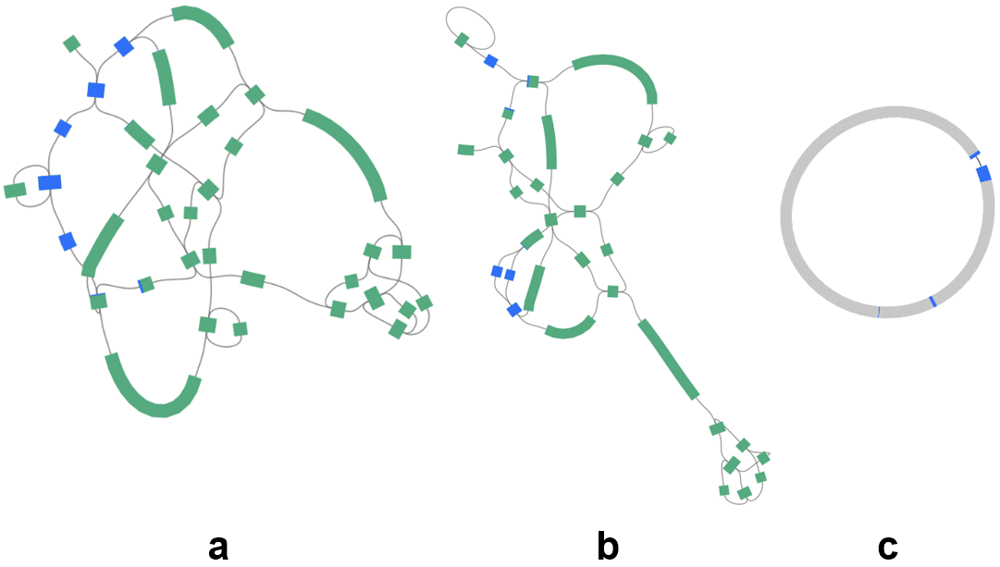
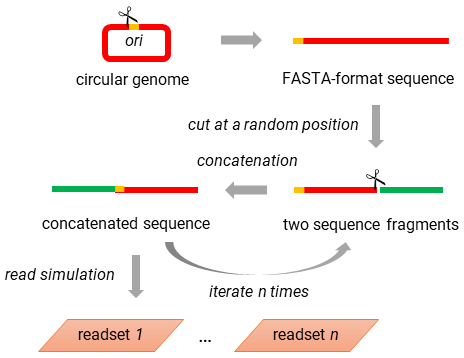
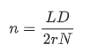

# readSimulator

A read simulator producing synthetic paired-end short sequencing reads from circular or linear genomes

*By Yu Wan*


**Table of contents**

- [Introduction](#introduction)
- [Installation](#installation)
- [Quick usage](#demonstration)
- [Method](#method)
- [Options and arguments](#arguments)
- [Helper scripts](#helpers)
- [Appendix](#appendix)


## 1. Introduction <a name = "introduction"></a>
Generation of short sequencing reads from template genomes plays an important role in testing new bioinformatics methods as well as performing phylogenetic analysis. Nonetheless, most published read simulators focus on eukaryotic chromosome genomes, and as a result, the topology of template DNA sequences are considered linear by these programs. Only a few pieces of software have been developed so far for simulating short reads from prokaryotic or archaeal genomes, which often have a circular topology. One tool of this kind is the program package [GemSIM](https://sourceforge.net/projects/gemsim/)<sup>2</sup>, however, it does not run under Python 2.7 or above.  Moreover, error models for read simulation by GemSIM are often not publicly available owing to limited software support and documentation.  

ReadSimulator is hence developed to address the shortage of software that takes into account the circular topology of some template genomes for read simulation. It is a Python script runs either [wgsim](https://github.com/lh3/wgsim) or [ART](https://www.niehs.nih.gov/research/resources/software/biostatistics/art/)<sup>1</sup> to generate synthetic paired-end short reads from circular or linear genomes. The code repository of ReadSimulator also offers two helper scripts (`poolFastaBySample.py` and `readSimulator_slurm.py`) to users.


## 2. Installation <a name = "installation"></a>

ReadSimulator has the following dependencies:

- Python 3.5.2 or above
- wgsim and ART


Users may clone the readSimulator repository to install all code:

```bash
git clone https://github.com/wanyuac/readSimulator.git
```


## 3. Quick usage <a name = "demonstration"></a>

See Section [5](#arguments) for an explanation of arguments used in the following commands. ReadSimulator reads FASTA files of template genomes for read simulation.


**Perfect synthetic reads**

```bash
python readSimulator.py --input ../references/*.fasta --simulator wgsim --simulator_path ../apps/wgsim --outdir shredded_reads --iterations 10 --readlen 76 --opts '-e 0 -r 0 -R 0 -X 0 -h -S 5'
```

Wgsim is an ideal program for simulating perfect (error-free) short reads from template genomes.


**Imperfect synthetic reads**

```bash
python readSimulator.py --input ../references/*.fasta --simulator art --simulator_path ../apps/art/art_illumina --outdir shredded_reads --iterations 10 --readlen 100 -opts '-m 300 -s 25 -qU 35 -nf 0 -rs 10 -ss HS20 -qs -1.5 -qs2 -2 -na'
```

Since imperfect synthetic reads contain a given level of sequencing errors, these reads are more realistic than perfect synthetic reads.


## 4. Method <a name = "method"></a>

An ideal assembly of a circular genome should be circular. Nonetheless, since the widely used FASTA format stores circular sequences as linear strings using an arbitrary breakpoint (often the origin of replication site), read simulators specialised to linear DNA sequences do not produce any read spanning over the breakpoint, potentially reducing the circularity of a *de novo* genome assembly (Fig. 1).   

<figure>
    
    <figcaption><b>Figure 1. Necessity of considering the topology of circular DNA for read simulation.</b> This demonstration is created from the nucleotide sequence of plasmid pK2044 of <i>Klebsiella pneumoniae</i> strain NTUH-K2044 (RefSeq accession: NC_006625) with readSimulator, ART v2.5.1, and SPAdes v3.6.2. Assembly graphs are visualised using <a href = "https://github.com/rrwick/Bandage">Bandage</a><sup>3</sup>. (<b>a</b>) A <i>de novo</i> assembly of the plasmid using perfect short reads synthesised when taking into accound the circular topology of the plasmid. The sequence of a region comprised of five consecutive nodes is extracted from the assembly graph for alignment. I call this sequence <i>r</i> for simplicity. (<b>b</b>) A <i>de novo</i> assembly of the same plasmid using perfect reads synthesised when considering the DNA as a linear sequence. Blue rgions show hits (at least 95% nucleotide identity) of sequence <i>r</i> in the assembly. (<b>c</b>) Genome of plasmid pK2044. Sequence <i>r</i> goes through the arbitrary breakpoint (used for creating the FASTA file) and shows repetitive short hits at a few locations. </figcaption>
</figure>

<br></br>

Given a linear sequence from a FASTA file, an approach to read simulation for a circular genome is to randomly shuffle the arbitrary breakpoint for several times (equivalent to fixing the position of our scissor but rotating the circular genome by a random degree every time), and after each replacement of the breakpoint, we cut the circular sequence and simulate reads from the resulting linear sequence (Fig. 2a). Finally, we pool all synthetic reads into a single set as the output (Fig. 2b). I refer to this algorithm as rotation-and-cut and have implemented it in readSimulator. The algorithm was proposed by [Ryan Wick](https://github.com/rrwick/), who noticed the necessity of considering the circular topology of bacterial DNA for read simulation.  

<figure>
    
    <figcaption><b>Figure 2. the rotation-and-cut algorithm for read simulation.</b> Thin arrows above sequences in panel <b>b</b> indicate the orentation of fragments cut from linear sequences.</figcaption>
</figure>

<br></br>

Given *N* iterations of sequence "rotation" and a target total read depth *D*, readSimulator calculates the target read depth (also known as the fold coverage) with the Lander-Waterman equation<sup>4</sup>. Accordingly, for a circular genome of length *L*, the desired number (*n*) of synthetic paired-end reads (read length *r*) per round is calculated by:



<!--$$
#n = \frac{LD}{2rN}
$$-->
Accordingly, the number of rotations (*N*) must not be too large to get an even distribution of synthetic reads on the template genome. An integer between 2 and 10 would be sufficient for most of cases of circular-mode simulation (default: 1, no rotation or linear mode simulation). In summary,  

- *N = 1*: linear mode, which treats the template genome as a linear sequence;
- *N > 1*: circular mode, which considers the template genome as a circular sequence.


## 5. Options and arguments <a name="arguments"></a>

Run ```python readSimulator.py --help``` to print information about options and arguments. ReadSimulator supports multi-FASTA formatted inputs, where each FASTA file consists of all template DNA sequences (e.g., the chromosome and plasmids) of a genome (or sample). The output for each genome is a set of synthetic reads generated from all the template sequences of that genome.

```bash
$ python readSimulator.py --help
usage: readSimulator.py [-h] --input INPUT [INPUT ...] [--simulator SIMULATOR]
                        [--simulator_path SIMULATOR_PATH] [--outdir OUTDIR]
                        [--iterations ITERATIONS] [--readlen READLEN]
                        [--depth DEPTH] --opts OPTS [--check_cmd]

Simulate reads based on reference sequences

optional arguments:
  -h, --help            show this help message and exit
  --input INPUT [INPUT ...]
                        FASTA files containing reference sequences for
                        shredding
  --simulator SIMULATOR
                        Name for the simulator. Supported: wgsim, art.
  --simulator_path SIMULATOR_PATH
                        The path and file name of the shredder
  --outdir OUTDIR       Directory for output files
  --iterations ITERATIONS
                        Number of arbitrary sequence breakpoints for read
                        simulation. (default: 1, treating the template genome
                        as a linear sequence)
  --readlen READLEN     Read length
  --depth DEPTH         Required approximate fold coverage of every sequence.
                        Default: 70 folds
  --opts OPTS           A string of other options and arguments to be passed
                        to the read simulator.
  --check_cmd           Configure it to print command lines only.
```

Note that wgsim only supports a uniform error rate of all synthetic reads, whereas ART uses built-in error profiles of various sequencers. Therefore, wgsim is ideal for generating perfect reads and ART is the preferred tool for producing realistic reads.


## 6. Helper scripts <a name = "helpers"></a>

The readSimulator repository offers two helper scripts in addition to `readSimulator.py`.

### readSimulator\_slurm.py

This script launches parallel jobs of readSimulator.py on a computer cluster through the [Slurm workload manager](https://slurm.schedmd.com/documentation.html). 

```bash
$ python readSimulator_slurm.py --help
usage: readSimulator_slurm.py [-h] --input INPUT [INPUT ...] [--path PATH]
                              [--mem MEM] [--walltime WALLTIME] [--wait WAIT]
                              --opts OPTS

Simulate reads based on reference sequences

optional arguments:
  -h, --help            show this help message and exit
  --input INPUT [INPUT ...]
                        FASTA files containing reference sequences for
                        shredding
  --path PATH           The directory containing the readSimulator.py script
  --mem MEM             Memoery (Mb) per job. Default: 2048.
  --walltime WALLTIME   Walltime of each job. Default: 0-0:30:0
  --wait WAIT           Time interval in seconds between submission of two
                        jobs. Default: 1
  --opts OPTS           A string passed to readSimulator.py for arguments
```


### poolFastaBySample.py

This script pools sequences from individual FASTA files of the same genome (sample) into a multi-FASTA file for the input of readSimulator.py. Script `poolFastaBySample.py` presumes that names of the input FASTA files are compatible with the output of my script `download_NCBI_records.py` (repository [BINF\_toolkit](https://github.com/wanyuac/BINF_toolkit)). Specifically, the filenames should follow the format: `[sample name]__[accession number].fasta`. Accordingly, `poolFastaBySample.py` creates `[sample name].fasta` through concatenating `[sample name]__*.fasta`.

A two-column tab-delimited plain-text file is taken as input by this script. The first column lists the sample names, and for each sample, a comma-delimited string consisting of accession numbers of DNA sequences is provided in the second column.

```bash
python poolFastaBySample.py --help
usage: poolFastaBySample.py [-h] --input INPUT
                            [--filename_delim FILENAME_DELIM]
                            [--col_delim COL_DELIM] [--col2_delim COL2_DELIM]
                            [--indir INDIR] [--input_ext INPUT_EXT]
                            [--outdir OUTDIR] [--output_ext OUTPUT_EXT]

Pool FASTA files together by each sample.

optional arguments:
  -h, --help            show this help message and exit
  --input INPUT         A two-column text file for filenames
  --filename_delim FILENAME_DELIM
                        Delimiter for two fields in input file names
  --col_delim COL_DELIM
                        Delimiter separating two columns of the input file
  --col2_delim COL2_DELIM
                        Delimiter for values in the second column of the input
                        file
  --indir INDIR         Directory of input FASTA files
  --input_ext INPUT_EXT
                        Filename extension of input FASTA files
  --outdir OUTDIR       Output directory
  --output_ext OUTPUT_EXT
                        Filename extension of output FASTA files
```


## 7. Appendix <a name = "appendix"></a>

**Licence**

ReadSimulator is licensed under the GNU General Public License v3.0.

**Editorial history**

Publication: 21 December 2019

<hr />

**References**

1. Huang, W., Li, L., Myers, J. R., & Marth, G. T. (2012). ART: A next-generation sequencing read simulator. *Bioinformatics, 28*(4), 593–594. https://doi.org/10.1093/bioinformatics/btr708.
2. McElroy, K. E., Luciani, F., & Thomas, T. (2012). GemSIM: general, error-model based simulator of next-generation sequencing data. *BMC Genomics, 13*(1), 74. https://doi.org/10.1186/1471-2164-13-74.
3. Wick, R. R., Schultz, M. B., Zobel, J., & Holt, K. E. (2015). Bandage: interactive visualization of de novo genome assemblies. *Bioinformatics*. https://doi.org/10.1093/bioinformatics/btv383.
4. Lander, E. S., & Waterman, M. S. (1988). Genomic mapping by fingerprinting random clones: A mathematical analysis. *Genomics, 2*(3), 231–239. https://doi.org/http://dx.doi.org/10.1016/0888-7543(88)90007-9.
